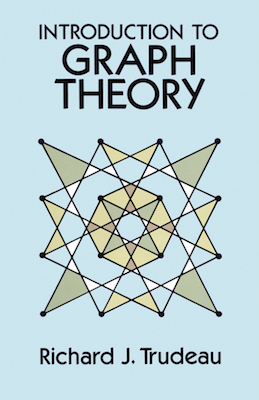
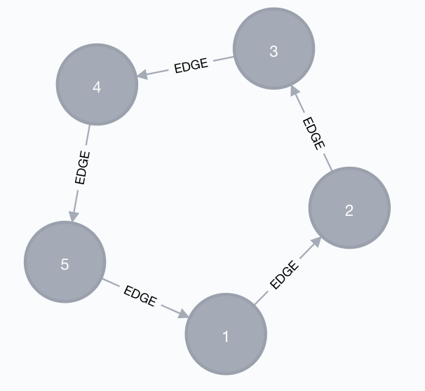
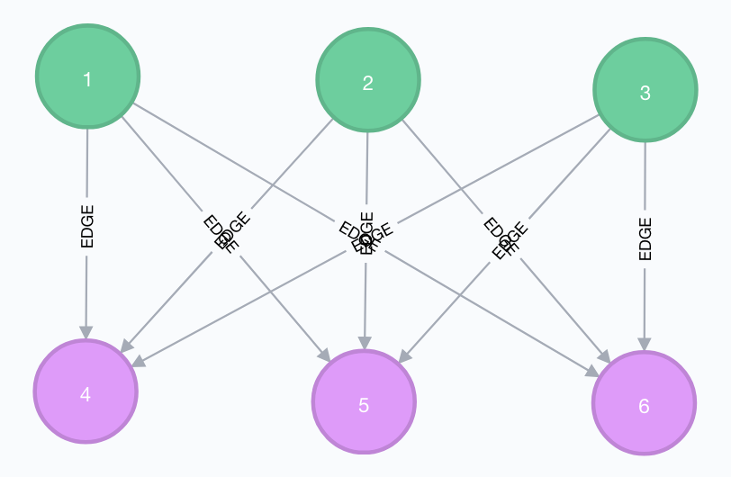
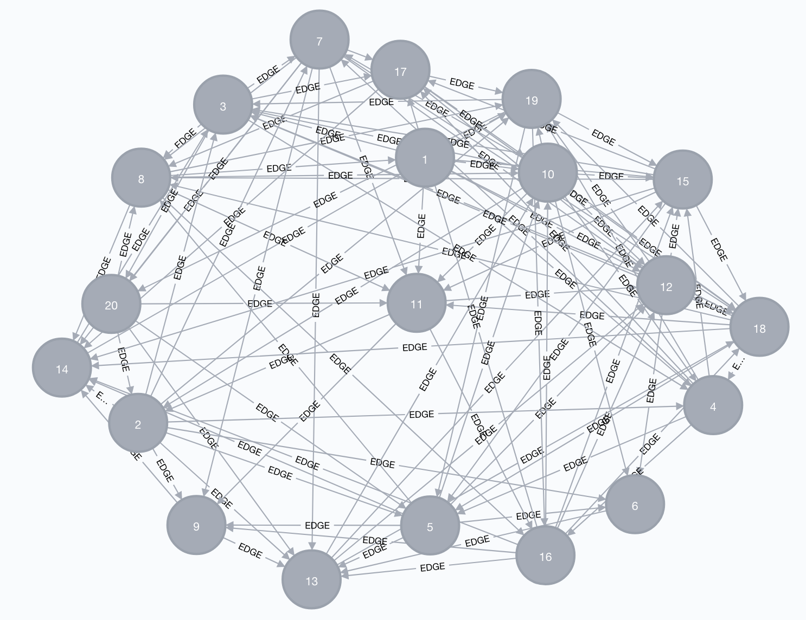
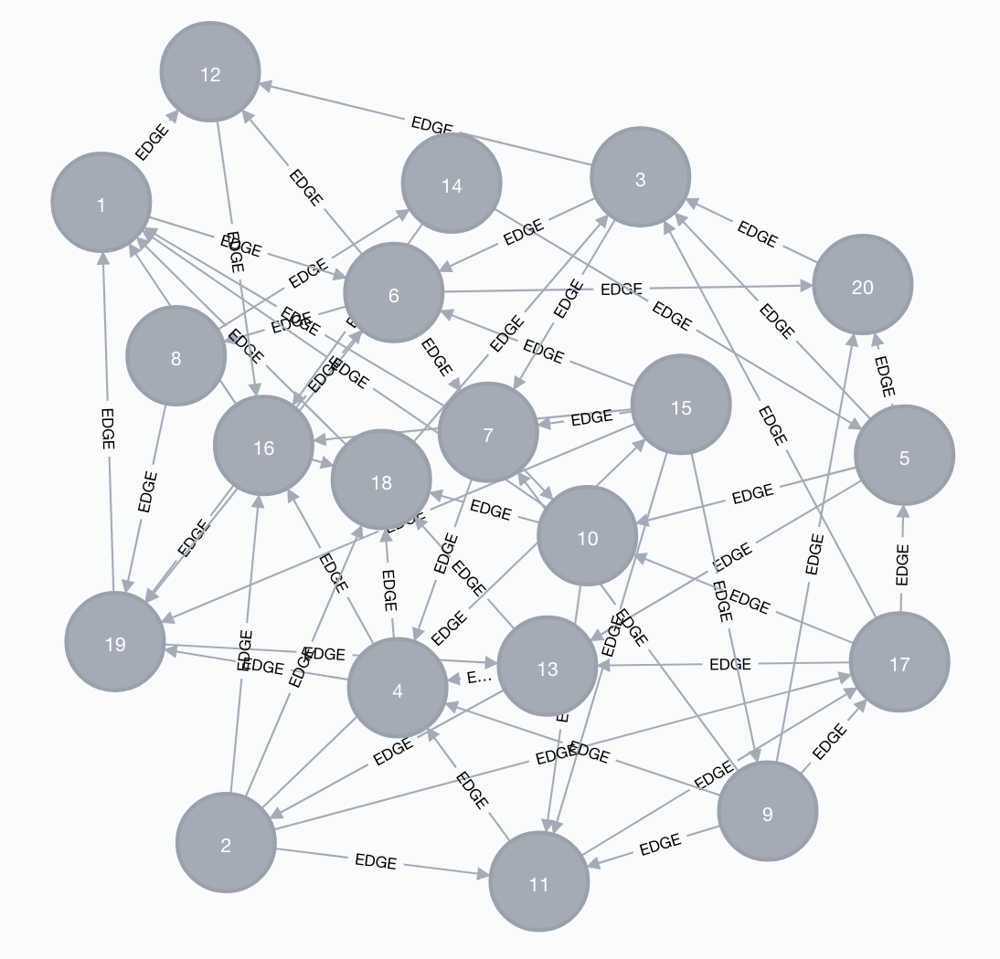
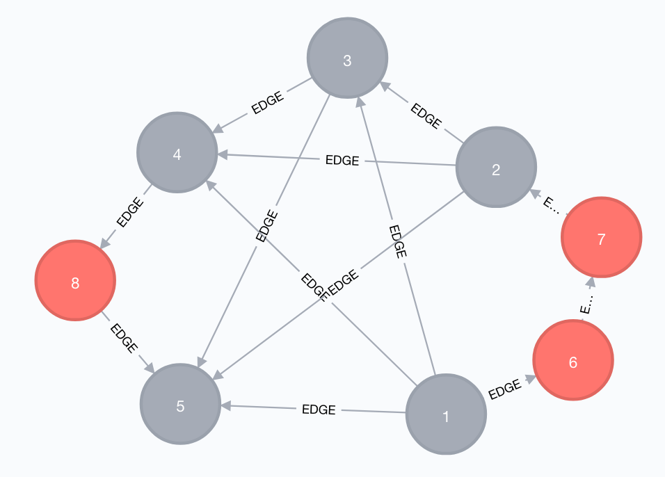
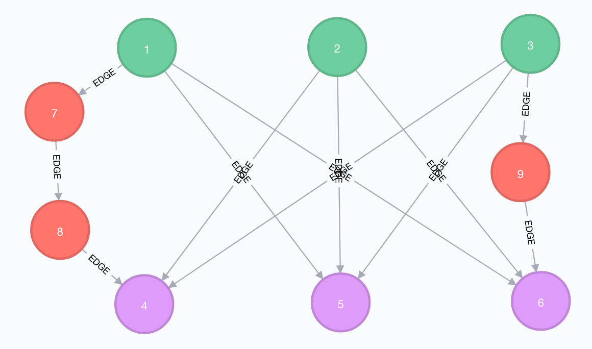

# Graph Theory - Neo4j

**Table of content**

- [Graph Theory - Neo4j](#graph-theory---neo4j)
    - [Introduction](#introduction)
    - [Circular Graphs](#circular-graphs)
    - [Complete Graphs](#complete-graphs)
    - [Utility Graph](#utility-graph)
    - [Random Graphs](#random-graphs)
        - [Random Graphs - Method 1](#random-graphs---method-1)
        - [Random Graphs - Method 2](#random-graphs---method-2)
        - [Implementation Details](#implementation-details)
    - [Subgraphs](#subgraphs)
        - [Circular Subgraphs](#circular-subgraphs)
        - [Complete Subgraphs](#complete-subgraphs)
            - [Complete Subgraphs - Method 1](#complete-subgraphs---method-1)
            - [Complete Subgraphs - Method 2](#complete-subgraphs---method-2)
        - [Utility Subgraphs](#utility-subgraphs)
    - [Planar Graphs](#planar-graphs)
        - [Identifying Nonplanar Graphs](#identifying-nonplanar-graphs)
            - [Test Cases](#test-cases)
            - [Graph Reduction](#graph-reduction)
                - [Graph Reduction - Method 1](#graph-reduction---method-1)
                - [Graph Reduction - Method 2](#graph-reduction---method-2)
    - [Conclusion](#conclusion)

## Introduction

This workshop was inspired by the book [Introduction to Graph Theory](http://store.doverpublications.com/0486678709.html) by **Richard J. Trudeau**.

I strongly recommend reading it to anyone who is interested in graph theory, but doesn't know where to start from.

<center></center>

*Cover reproduced with permission from [Dover publications](http://www.doverpublications.com).*

The challenge is to implement graph theory concepts using pure [Neo4j](https://neo4j.com) [Cypher](https://neo4j.com/developer/cypher-query-language/) query language, without the help of any libraries such as [Awesome Procedures On Cypher](https://github.com/neo4j-contrib/neo4j-apoc-procedures) (APOC).

## Circular Graphs

> A **cycle graph** or **circular graph** is a graph that consists of a single cycle, or in other words, some number of vertices connected in a closed chain.

*Taken from [Wikipedia](https://en.wikipedia.org/wiki/Cycle_graph).*

A circular graph with **n** vertices is annotated **Cn**.

```cypher
WITH 5 AS Count
WITH range(1, Count) AS items
WITH [x in tail(items) | [x - 1, x]] + [[last(items), head(items)]] AS tuples
FOREACH (
    tuple IN tuples |
    MERGE (s:Vertex {id: head(tuple)})
    MERGE (t:Vertex {id: last(tuple)})
    CREATE (s)-[:EDGE]->(t)
);
```

Output:

```
Added 5 labels, created 5 nodes, set 5 properties, created 5 relationships.
```



[Cypher Query](cypher/Cn.create.cypher), [Neo4j Console](http://console.neo4j.org/r/cvvcih).

## Complete Graphs

> A **complete graph** is a simple undirected graph in which every pair of distinct vertices is connected by a unique edge. 

*Taken from [Wikipedia](https://en.wikipedia.org/wiki/Complete_graph).*

A complete graph with **n** vertices is annotated **Kn**.

```cypher
WITH 5 AS Count
WITH range(1, Count) AS items
FOREACH (
    s_id IN items |
    FOREACH (
        t_id IN filter(item in items WHERE item <> s_id) |
        MERGE (s:Vertex {id: s_id})
        MERGE (t:Vertex {id: t_id})
        MERGE (s)-[:EDGE]-(t)
    )
);
```

Output:

```
Added 5 labels, created 5 nodes, set 5 properties, created 10 relationships.
```


[Cypher Query](cypher/Kn.create.cypher), [Neo4j Console](http://console.neo4j.org/r/f7jkiz).

## Utility Graph

> The **utility graph** is a reference to the mathematical puzzle known as the three utilities problem.

> Suppose there are three cottages on a plane (or sphere) and each needs to be connected to the gas, water, and electricity companies. Without using a third dimension or sending any of the connections through another company or cottage, is there a way to make all nine connections without any of the lines crossing each other?

*Taken from [Wikipedia](https://en.wikipedia.org/wiki/Three_utilities_problem).*

An utility graph with **6** vertices (3 cottages and 3 utilities) is annotated **K3,3**.

```cypher
WITH 3 AS Count
WITH
    range(1, Count) AS items_h,
    range(Count + 1, Count * 2) AS items_u
FOREACH (
    item_h IN items_h |
    CREATE (s:House {id: item_h})
    FOREACH (
        item_u IN items_u |
        MERGE (t:Utility {id: item_u})
        MERGE (s)-[:EDGE]-(t)
    )
);
```

Output:
```
Added 6 labels, created 6 nodes, set 6 properties, created 9 relationships.
```



*Cottages vertices are coloured in green, utilities in purple.*

[Cypher Query](cypher/UG.create.cypher), [Neo4j Console](http://console.neo4j.org/r/9ut6vw).

## Random Graphs

The purpose is to create a randomly generated graph.

### Random Graphs - Method 1

Connect each vertex to N other vertices (N being randomly chosen).

```cypher
WITH
    // Number of nodes in graph
    20 AS NodeCount,
    // Limiting factor to determine adjacent nodes (out-degree)
    // AdjacentNodeCount = rand(1, NodeCount) / AdjacentNodeCountFactor
    5 AS AdjacentNodeCountFactor
WITH
    NodeCount,
    AdjacentNodeCountFactor,
    range(1, NodeCount) AS items
FOREACH (
    item_s in items |
    MERGE (s:Vertex {id: item_s})
    FOREACH (
        item_t in filter(
            y IN [
                x IN range(1, toInteger(round((rand() * (NodeCount - 1) + 1 / AdjacentNodeCountFactor))) /*Adjacent Nodes Count*/) |
                toInteger(round(rand() * (NodeCount - 1) + 1)) /*Target Node*/
            ] WHERE y <> item_s /*Avoid self-relationships*/
        ) |
        MERGE (t:Vertex {id: item_t})
        MERGE (s)-[:EDGE]-(t)
    )
);
```

Output:

```
Added 20 labels, created 20 nodes, set 20 properties, created 116 relationships.
```



[Cypher Query v1](cypher/Random.create.v1.cypher), [Neo4j Console](http://console.neo4j.org/r/9j48t).

Caveat: this method provides a limited control over the maximum degree of each vertex (the **degree** of an edge is the number of vertices connected to that edge).

### Random Graphs - Method 2

Build vertices relationships from an [adjacency matrix](https://en.wikipedia.org/wiki/Adjacency_matrix).

```cypher
WITH
    // Number of nodes in graph
    20 AS NodeCount,
    // Probability that two vertices are adjacent (default = 1/2, as with unbiased flipped coin).
    1.0 / 10 AS AdjacencyProbability
WITH
    NodeCount,
    AdjacencyProbability,
    [x IN range(1, toInteger(NodeCount ^ 2)) | toInteger(rand() * (1 + AdjacencyProbability * 2))] AS AdjacencyMatrix
FOREACH (
    row IN range(1, NodeCount) |
    MERGE (s:Vertex {id: row})
    FOREACH (
        col IN [c IN range(1, NodeCount) WHERE c <> row | c] /*Avoid self-relationships*/ |
        FOREACH (
            // Pick coordinates of adjacent vertices.
            item_t IN filter(
                i IN [(row - 1) * NodeCount + col]
                WHERE AdjacencyMatrix[i] <> 0
             ) |
            MERGE (t:Vertex {id: col})
            MERGE (s)-[:EDGE]-(t)
        )
    )
);
```

Output:

```
Added 20 labels, created 20 nodes, set 20 properties, created 62 relationships
```



This method provides more control over the maximum degree of each vertex, using `AdjacencyProbability` value.

[Cypher Query v2](cypher/Random.create.v2.cypher), [Neo4j Console](http://console.neo4j.org/r/pa8k21).

### Implementation Details

Random numbers are generated using **rand** function, which returns a real number between 0 and 1.

Getting a random number between 1 and 15:

```cypher
RETURN round(rand() * (15 - 1) + 1);
```

[Cypher Query](cypher/RandomNumbers.cypher), [Neo4j Console](http://console.neo4j.org/r/veitks).

Getting a random number in set {0, 1} (Boolean):

```cypher
RETURN toInteger(rand() * 2)
```

[Cypher Query](cypher/RandomNumbersBoolean.cypher), [Neo4j Console](http://console.neo4j.org/r/8fnpcg).

## Subgraphs

> A **subgraph** of a graph G is another graph formed from a subset of the vertices and edges of G.

*Taken from [Wikipedia](https://en.wikipedia.org/wiki/Glossary_of_graph_theory_terms#subgraph).*

> A **subgraph** is obtained by selectively removing edges and vertices from a graph.

> By opposition, a **supergraph** is obtained by selectively adding edges and vertices to a graph.

*Taken from [Introduction to Graph Theory](http://store.doverpublications.com/0486678709.html).*

The goal is to find a subgraph of a certain type :

- [Circular Graphs](#circular-graphs).
- [Complete Graphs](#complete-graphs).
- [Utility Graph](#utility-graph).

### Circular Subgraphs

```cypher
MATCH
    (a)-[]-(b),
    (b)-[]-(c),
    (c)-[]-(d),
    (d)-[]-(e)
WHERE
    NOT a IN [b, c, d, e]
    AND NOT b IN [c, d, e]
    AND NOT c IN [d, e]
    AND NOT d IN [e]
RETURN *;
```

[Cypher Query](cypher/C5.find.cypher), [Neo4j Console](http://console.neo4j.org/r/8qg0k).

### Complete Subgraphs

#### Complete Subgraphs - Method 1

```cypher
MATCH
    (a)-[]-(b), (a)-[]-(c), (a)-[]-(d), (a)-[]-(e),
    (b)-[]-(c), (b)-[]-(d), (b)-[]-(e),
    (c)-[]-(d), (c)-[]-(e),
    (d)-[]-(e)
WHERE
    NOT a IN [b, c, d, e]
    AND NOT b IN [c, d, e]
    AND NOT c IN [d, e]
    AND NOT d IN [e]
RETURN *
LIMIT 1;
```

[Cypher Query](cypher/K5.find.v1.cypher), [Neo4j Console](http://console.neo4j.org/r/t691rb).

Caveat: the **WHERE** part of the query, used to guarantee distinct vertices, is repetitive.

#### Complete Subgraphs - Method 2

The following is an alternative query using [Awesome Procedures On Cypher](https://github.com/neo4j-contrib/neo4j-apoc-procedures) for the **WHERE** part.

```cypher
// Alternative query using APOC
MATCH
    (a)-[]-(b), (a)-[]-(c), (a)-[]-(d), (a)-[]-(e),
    (b)-[]-(c), (b)-[]-(d), (b)-[]-(e),
    (c)-[]-(d), (c)-[]-(e),
    (d)-[]-(e)
WHERE size(apoc.coll.toSet([a, b, c, d, e])) = 5
RETURN *
LIMIT 1;
```

[Cypher Query](cypher/K5.find.v2.cypher).

### Utility Subgraphs

```cypher
MATCH
    (h1)-[r1_1]-(u1),
    (h1)-[r1_2]-(u2),
    (h1)-[r1_3]-(u3),
    (h2)-[r2_1]-(u1),
    (h2)-[r2_2]-(u2),
    (h2)-[r2_3]-(u3),
    (h3)-[r3_1]-(u1),
    (h3)-[r3_2]-(u2),
    (h3)-[r3_3]-(u3)
WHERE
    NOT h1 IN [h2, h3, u1, u2, u3]
    AND NOT h2 IN [h3, u1, u2, u3]
    AND NOT h3 IN [u1, u2, u3]
    AND NOT u1 IN [u2, u3]
    AND NOT u2 IN [u3]
RETURN
    h1, h2, h3,
    u1, u2, u3,
    r1_1, r1_2, r1_3,
    r2_1, r2_2, r2_3,
    r3_1, r3_2, r3_3
LIMIT 1;
```

[Cypher Query](cypher/UG.find.v1.cypher), [Neo4j Console](http://console.neo4j.org/r/t7ftxq).

Caveat: as with the [complete subgraph](#complete-subgraphs), the **WHERE** part of the query is repetitive, and can be simplified with the help of [Awesome Procedures On Cypher](https://github.com/neo4j-contrib/neo4j-apoc-procedures), as shown in this [alternative Cypher query](cypher/UG.find.v2.cypher).

## Planar Graphs

> In graph theory, a **planar** graph is a graph that can be embedded in the plane, i.e., it can be drawn on the plane in such a way that its edges intersect only at their endpoints. In other words, it can be drawn in such a way that no edges cross each other.

*Taken from [Wikipedia](https://en.wikipedia.org/wiki/Planar_graph).*

> A graph is **planar** if it is isomorphic to a graph that has been drawn in a plane without edge-crossings. UG and K5 are examples of nonplanar graphs.

> If some new vertices of degree 2 are added to some of the edges of a graph G, the resulting graph H is called an **expansion** of G.

*Taken from [Introduction to Graph Theory](http://store.doverpublications.com/0486678709.html).*

### Identifying Nonplanar Graphs

[Kuratowski's theorem](https://en.wikipedia.org/wiki/Kuratowski%27s_theorem) states that:

> Every nonplanar graph is a supergraph of an expansion of UG or K5.

The standard method consists in finding a subgraph that is an expansion of UG or K5 (as stated in pages 85-86 of [Introduction to Graph Theory](http://store.doverpublications.com/0486678709.html) book).

As this method could lead to an never-ending task (the set of of expansions of a graph being non-finite), we are going to reason in a reverse-way.

Method:

1. [Reduce graph](#graph-reduction) by removing all vertices (and its edges) having degree 2.
    - Find vertices (b) having degree 2: `(a)-(b)-(c)`.
    - Substitute path by removing (b) and creating new edge between connected vertices: `(a)-(c)`.
    - Repeat the operation until no more vertices are found.
2. Find [K5](#complete-subgraphs) or [UG](#utility-subgraphs) [subgraphs](#subgraphs).

#### Test Cases

The following is an expansion of **K5 graph**:



*Red vertices were generated by graph expansion.*

[Cypher Query](cypher/K5.expand.cypher), [Neo4j Console](http://console.neo4j.org/r/79ht9u).

The following is an expansion of the **Utility Graph**:



[Cypher Query](cypher/UG.expand.cypher), [Neo4j Console](http://console.neo4j.org/r/9rt89c).

#### Graph Reduction

##### Graph Reduction - Method 1

Our first method requires two scripts:

1. Identification of vertices having degree 2.
2. Vertices removal and edge substitution.

The all process must be repeated until no more vertices are found.

Step 1:

```cypher
MATCH (n)-[r]-()
WITH n, COUNT(r) AS Degree
WHERE Degree = 2
WITH collect(DISTINCT n) AS Nodes
RETURN Nodes;
```

[Cypher Query](cypher/Expansion.reduction.v1.step1.cypher)

Step 2:

```cypher
MATCH (n)-[r]-()
WITH n, COUNT(r) AS Degree
WHERE Degree = 2
MATCH (a)-[r1]-(n)-[r2]-(b)
MERGE (a)-[:EDGE]-(b)
DETACH DELETE n;
```

[Cypher Query](cypher/Expansion.reduction.v1.step2.cypher)

Caveat: this method requires some processing logic around Cypher queries execution, making it more complex to implement than if we had a single Cypher query.

##### Graph Reduction - Method 2

Our second method consists in:

1. Getting all vertices involved in expanded paths (i.e. only containing vertices with degree 2).
2. Deleting in-between vertices and their connected edges.
3. Adding an edge between starting and ending vertices of each path.

```cypher
// Paths with two or more edges
MATCH p = (s)-[*2..]-(t)
WITH nodes(p) AS PathNodes
WITH
    // Vertices in path
    PathNodes,
    // Starting and ending vertices
    [head(PathNodes), last(PathNodes)] AS ExternalNodes
WITH
    ExternalNodes,
    // In-between vertices...
    filter(n IN PathNodes WHERE NOT n IN ExternalNodes) AS InsideNodes
WHERE
    // ...having degree 2
    all(n IN InsideNodes WHERE size((n)-[]-()) = 2)
WITH
    InsideNodes,
    ExternalNodes
// Create edge between starting and ending vertices
MATCH (s) WHERE s = head(ExternalNodes)
MATCH (t) WHERE t = last(ExternalNodes)
MERGE (s)-[:EDGE]-(t)
// Remove in-between vertices 
FOREACH(
    n IN InsideNodes |
    DETACH DELETE n
);
```

[Cypher Query](cypher/Expansion.reduction.v2.cypher), [Neo4j Console for K5](http://console.neo4j.org/r/85xctk), [Neo4j Console for UG](http://console.neo4j.org/r/5zafcw).

This second method is our preferred one, as it only relies on Cypher, with no execution logic around.

## Conclusion

This workshop was the opportunity to demonstrate the potential of [Neo4j](https://neo4j.com) [Cypher](https://neo4j.com/developer/cypher-query-language/) query language in solving mathematical problems around graph theory.

There will hopefully be some additions as I'm still in the process of reading [Introduction to Graph Theory](http://store.doverpublications.com/0486678709.html) book.
